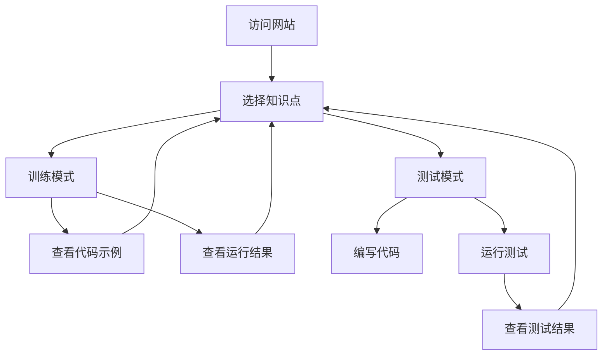

## 1. Product Overview
Pandas 实战训练营：十项核心技能是一个交互式学习平台，帮助初学者掌握 Pandas 数据分析的核心技能。
- 目标用户为数据科学初学者、学生和需要提升数据分析能力的专业人士
- 通过实践训练和测试模式，提供沉浸式学习体验，降低数据分析入门门槛

## 2. Core Features

### 2.1 User Roles
| Role | Registration Method | Core Permissions |
|------|---------------------|------------------|
| 学习者 | 无需注册 | 访问所有学习内容，使用训练和测试模式 |

### 2.2 Feature Module
1. **主页**：网站标题，导航栏，知识点列表
2. **知识点页面**：训练模式，测试模式，数据展示

### 2.3 Page Details
| Page Name | Module Name | Feature description |
|-----------|-------------|---------------------|
| 主页 | 导航栏 | 展示十个 Pandas 核心知识点，点击切换页面 |
| 知识点页面 | 训练模式 | 展示知识点说明，示例代码，运行结果 |
| 知识点页面 | 测试模式 | 提供代码输入框，运行测试按钮，结果反馈 |
| 知识点页面 | 数据展示 | 显示示例 DataFrame，支持表格查看 |

## 3. Core Process
用户访问网站 → 选择知识点 → 切换训练/测试模式 → 在训练模式中学习代码示例 → 在测试模式中编写代码 → 运行测试并查看结果 → 切换到其他知识点继续学习

## 4. User Interface Design
### 4.1 Design Style
- 主色调：#4CAF50（绿色）和 #2196F3（蓝色）
- 次要色：#FFC107（黄色）和 #F44336（红色）
- 按钮风格：圆角按钮，悬停效果
- 字体：Sans-serif 字体，标题 24px，正文 16px
- 布局风格：卡片式布局，清晰的层次结构
- 图标风格：简约线性图标，配合文字说明

### 4.2 Page Design Overview
| Page Name | Module Name | UI Elements |
|-----------|-------------|-------------|
| 主页 | 导航栏 | 顶部固定导航栏，包含网站标题和知识点链接，响应式设计 |
| 知识点页面 | 模式切换 | 标签式切换按钮，训练模式和测试模式，视觉清晰 |
| 知识点页面 | 训练模式 | 代码块区域，语法高亮，运行结果表格展示 |
| 知识点页面 | 测试模式 | 代码输入框（高度 150px），运行测试按钮，结果反馈区域 |
| 知识点页面 | 数据展示 | 表格形式展示 DataFrame，支持滚动查看 |

### 4.3 Responsiveness
- 桌面优先设计，支持移动端自适应
- 在小屏幕设备上，导航栏折叠为下拉菜单
- 代码块和表格在移动端自动调整宽度

### 4.4 3D Scene Guidance
- 不适用，本项目为纯数据学习平台