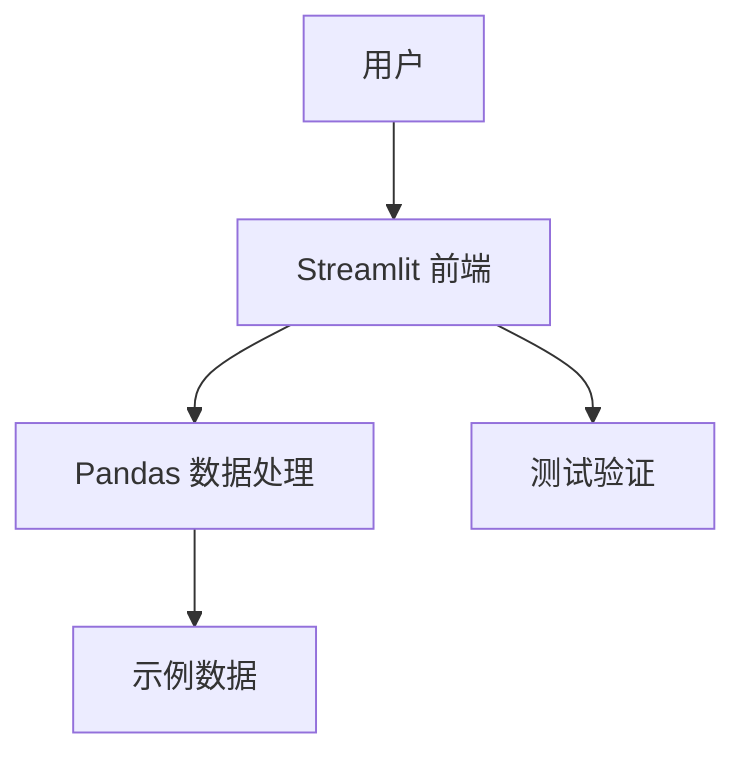

## 1. Architecture Design

## 2. Technology Description
- 前端：Streamlit
- 数据处理：Pandas
- 开发语言：Python 3.8+
- 依赖管理：pip

## 3. Route Definitions
| Route | Purpose |
|-------|---------|
| / | 主页，显示导航栏和默认知识点 |
| /skill/1 | 知识点 1：数据加载与查看 |
| /skill/2 | 知识点 2：数据筛选与索引 |
| /skill/3 | 知识点 3：处理缺失值 |
| /skill/4 | 知识点 4：数据分组与聚合 |
| /skill/5 | 知识点 5：数据合并与连接 |
| /skill/6 | 知识点 6：新增与修改列 |
| /skill/7 | 知识点 7：数据排序与排名 |
| /skill/8 | 知识点 8：字符串处理 |
| /skill/9 | 知识点 9：时间序列基础 |
| /skill/10 | 知识点 10：数据透视表 |

## 4. API Definitions
- 无后端 API，所有功能在前端通过 Streamlit 实现

## 5. Server Architecture Diagram
- 无后端服务器，Streamlit 应用直接运行

## 6. Data Model
### 6.1 Data Model Definition
- 无数据库，使用内存中的 DataFrame 进行数据处理

### 6.2 Data Definition Language
- 无数据库表定义，使用 Python 代码生成示例数据